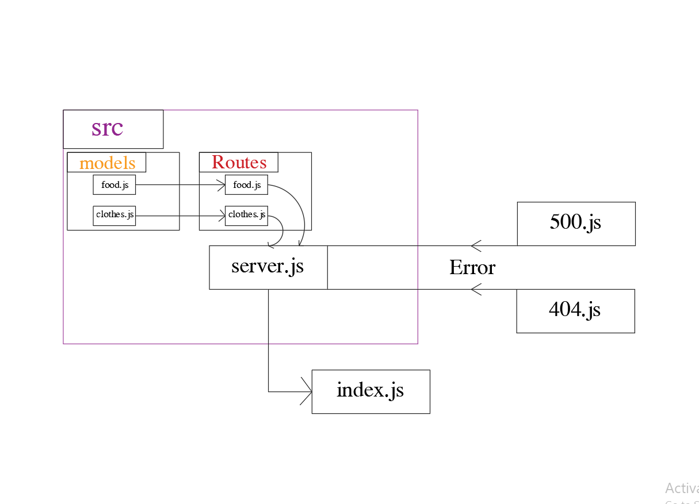

# basic-api-ser

### Author: Abdalrhman Albdahat
 ### links:
- [Heroku](https://basic-api-server-boodah.herokuapp.com/)
- [GitHub-repo](https://github.com/boodah96/basic-api-server)
- [PR](https://github.com/boodah96/basic-api-server/pull/1)

#### Start work with this commands:
- ``npm init -y npm i express dotenv cors morgan uuid``

- ``npm i -D jest supertest``

UML diagram:
